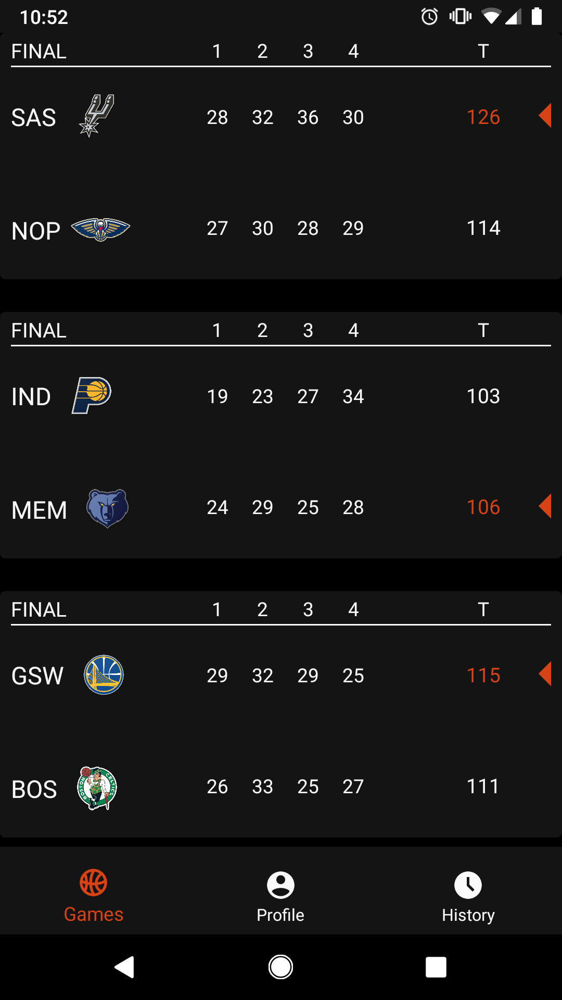
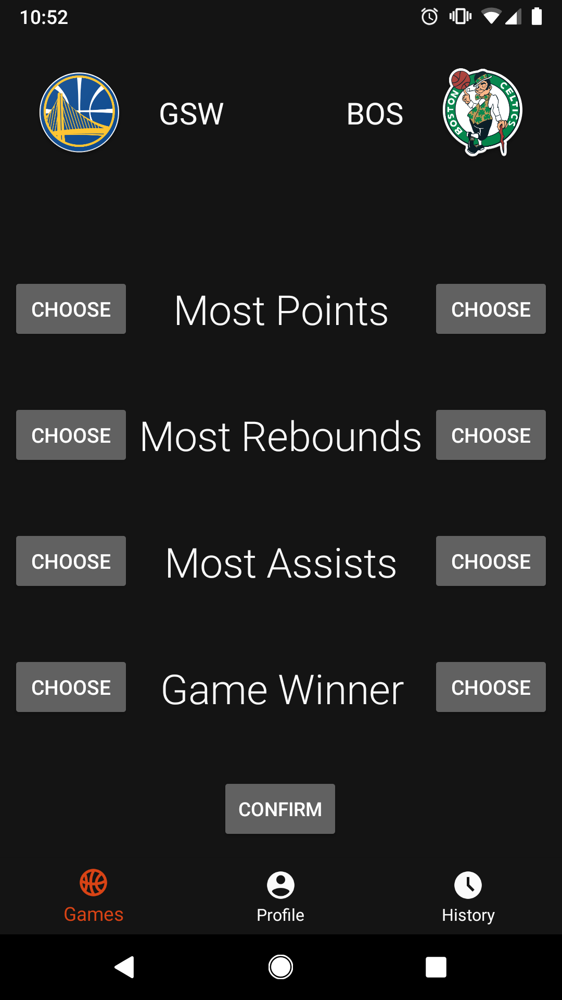

# Stat Guess - NBA
A statistics guessing game for the NBA. Players will try to predict who will get the most points, rebounds, assists etc, for each game of the day.

## Features
- [x] Display daily games with live scores
- [ ] Allow users to select games and predicted stat leaders
- [ ] Record and display previous user pick history
- [ ] Build and share user profile with pick percentages

## Libraries Used
- GSON
  - used to model NBA api JSON data
- Retrofit
  - used for networking calls to NBA api
- ViewModel/LiveData
  - used for MVVM architecture
- RxJava (in progress)
- Room
  - used to cache network data and save user selections
- Appliction pulls all data from official NBA API
  
## Screenshots/Images
 
